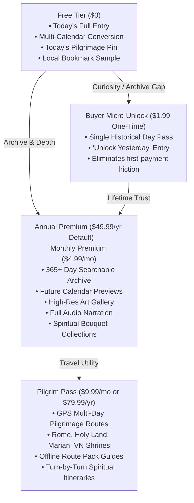
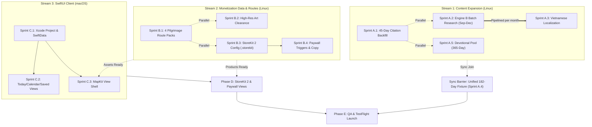

# Anno — Consolidated Master Audit & Feature Expansion Plan

**Canonical Continuity Tracker:** `MVP_PLAN_FINAL.md` / `ARCHITECTURE.md` / `Conversion-Design.md`  
**Date:** 2026-08-24  
**Status:** Active Execution Master Plan  

---

## 1. Executive Status & Ground Truth Audit

### 1.1 Verified Capabilities & Completed Foundations
* **Engine A (Deterministic Calendar Engine):** Pure Python date math ([`calendar_engine.py`](file:///home/ichabod/Projects/Anno/calendar_engine.py)) with zero LLM hallucination risk. Concurrently converts Gregorian, Hebrew, and Hijri calendars across 2026–2029.
* **Unified Bilingual Content Dataset:** [`Anno/Resources/anno_unified_2026.json`](file:///home/ichabod/Projects/Anno/Anno/Resources/anno_unified_2026.json) houses **59 normalized entries** (July 3, 2026 → August 31, 2026). Every entry contains 100% populated English and Vietnamese (`*_vi`) fields verified with accurate Vietnamese diacritics.
* **Fixture Pipeline:** [`tools/normalize_fixture.py`](file:///home/ichabod/Projects/Anno/tools/normalize_fixture.py) and [`tools/export_swift_fixture.py`](file:///home/ichabod/Projects/Anno/tools/export_swift_fixture.py) automate normalizations and compile fixtures directly into [`ios-fixtures/AnnoMockData.swift`](file:///home/ichabod/Projects/Anno/ios-fixtures/AnnoMockData.swift).
* **Localization:** 100% string coverage (25/25 keys) across `localization/en` and `localization/vi` `Localizable.strings` validated via [`tools/validate_localization.py`](file:///home/ichabod/Projects/Anno/tools/validate_localization.py).
* **Engine B Research Gate:** Source citation validator ([`tools/validate_engine_b_output.py`](file:///home/ichabod/Projects/Anno/tools/validate_engine_b_output.py)) enforces rigorous citation checks for LLM historical output.

### 1.2 Active Gaps & Bottlenecks
* **Source Citation Deficit:** 45 of 59 entries in the current unified fixture have empty source citation arrays (`sources: []`), causing [`tools/validate_mock_content.py`](file:///home/ichabod/Projects/Anno/tools/validate_mock_content.py) to fail.
* **Content Horizon:** Devotional research ends on August 31, 2026. September 1, 2026 → December 31, 2026 (and beyond) remains unresearched.
* **Environment Fencing:** Server-side tasks (Python generators, JSON validators, translation normalizers) run seamlessly on Linux (`ichabod`). Client-side tasks (Xcode scaffolding, SwiftData schema compilation, StoreKit 2 sandbox, TestFlight build) require macOS per [`docs/NATIVE_BUILD_RUNBOOK.md`](file:///home/ichabod/Projects/Anno/docs/NATIVE_BUILD_RUNBOOK.md).

---

## 2. Monetization & Value Architecture

### 2.1 Consumer Psychology & Value Proposition
* **Target Audience:** High-willingness-to-pay Catholic, Christian, and sacred history enthusiasts who actively invest in religious practice and faith-based travel.
* **Positioning:** Augments rather than competes with prayer apps (e.g. Hallow). While prayer apps monetize access to God/prayer routines, Anno monetizes **intellectual depth, sacred history, calendar time travel, and pilgrimage travel utility**.
* **Anti-Patterns Enforced:** Zero paid blessings, zero "pay-to-pray", zero guilt/shame mechanisms, zero interstitial/rewarded ads. Free tier remains robust for daily habit building; premium tier gates depth and utility.

### 2.2 Pricing Ladder & Tier Specifications



### 2.3 Four Conversion Levers
1. **Lever 1: The Calendar Time-Travel Archive**
   * *Free:* Full devotion and calendar conversion for today.
   * *Paywall Trigger:* Tapping yesterday, tomorrow, or browsing historical dates in the Calendar tab. Full-text search across saints, relics, and ecumenical councils.
2. **Lever 2: Sacred Geography & Pilgrimage Atlas**
   * *Free:* Today's feast birthplace or shrine pin on Apple Maps.
   * *Paywall Trigger:* Exploring the worldwide sacred map, filtering by historical era, or activating GPS-guided pilgrimage itineraries.
3. **Lever 3: Sacred Iconography & Daily Audio**
   * *Free:* Daily artwork thumbnail + 3 weekly audio listens.
   * *Paywall Trigger:* High-resolution zoomable sacred art dossiers and unlimited daily audio narration.
4. **Lever 4: Spiritual Bouquet & Saved Collections**
   * *Free:* Up to 5 local bookmarks.
   * *Paywall Trigger:* Custom prayer collections, novena trackers, exportable share cards ([`Anno/Components/ShareCard.swift`](file:///home/ichabod/Projects/Anno/Anno/Components/ShareCard.swift)).

---

## 3. Master Phased Delivery Roadmap

```
├── Phase A: Server-Side Data & Content Expansion (Linux) ── [Immediate]
│   ├── Sprint A.1: 45-Day Source Citation Backfill & Verification Gate
│   ├── Sprint A.2: Engine B Batch Research Generation (Sep 1 – Dec 31, 2026)
│   ├── Sprint A.3: Vietnamese Localization & Diacritic Audit (122 Days)
│   ├── Sprint A.4: Unified Fixture Merging & 6-Month Dataset Export
│   └── Sprint A.5: Devotional Pool (365-Day Rotation) Synthesis
│
├── Phase B: Monetization Data Schemas & Route Assets (Linux) ── [Immediate]
│   ├── Sprint B.1: Sacred Geography Pilgrimage Route Packs (Rome, Holy Land, Marian, VN)
│   ├── Sprint B.2: High-Resolution Sacred Art Dossiers & Clearance Metadata
│   ├── Sprint B.3: StoreKit 2 Product Definitions & Pricing Ladder Configurations
│   └── Sprint B.4: Paywall Trigger Rules & Entitlement State Payloads
│
├── Phase C: Native iOS Scaffolding & Core Views (macOS) ── [Fenced]
│   ├── Sprint C.1: Xcode Project Scaffolding & SwiftData Container
│   ├── Sprint C.2: Today, Calendar, and Saved Tab Integration
│   └── Sprint C.3: MapKit Pilgrimage Atlas & Route Polyline Overlays
│
├── Phase D: StoreKit 2 & Paywall Views (macOS) ── [Fenced]
│   ├── Sprint D.1: ArchivePaywallView & Dynamic Pricing Integration
│   ├── Sprint D.2: In-App Purchase Flows, Sandbox Testing & Restore Purchases
│   └── Sprint D.3: String Catalogs (EN + VI) Import
│
└── Phase E: Theological QA & TestFlight Launch ── [Final]
    ├── Sprint E.1: Liturgical & Ecclesiastical Review Sign-Off
    ├── Sprint E.2: Public Domain Artwork URL 200 OK Clearance
    └── Sprint E.3: App Store Connect TestFlight Submission
```

---

## 4. Concurrency & Parallel Execution Matrix

### 4.1 Cross-Track Concurrency Breakdown

| Track / Stream | Execution Host | Concurrency Level | Blocking Dependencies | What Can Run Concurrently |
|---|---|---|---|---|
| **Phase A: Content Expansion** | Linux (`ichabod`) | **High (80% parallelizable)** | None (uses existing calendar JSONL) | Can run completely in parallel with Phase B & Phase C. |
| **Phase B: Monetization Assets** | Linux (`ichabod`) | **Very High (95% parallelizable)** | None | Can run completely in parallel with Phase A & Phase C. |
| **Phase C: Native iOS Scaffold** | macOS (`surfacebook` / Mac) | **High (70% parallelizable)** | Needs current 59-day fixture (already exists!) | Can develop SwiftUI views & models concurrently while Phase A/B run on Linux. |
| **Phase D: StoreKit 2 & Paywalls** | macOS | **Medium** | Needs `AnnoProducts.storekit` & trigger schema from Sprint B.3/B.4 | Can build UI shell while testing products in sandbox. |
| **Phase E: QA & TestFlight** | macOS / Any | **Sequential Barrier** | Needs Phase A + C + D completion | Final integration gate. |

### 4.2 Granular Task-Level Parallelism



### 4.3 Summary of Parallel Potential
* **~85% of total pre-launch work is immediately parallelizable:**
  * **Independent Server Tracks:** Sprints A.1, A.2 (broken down by month), A.5, B.1 (all 4 routes concurrently), B.2, and B.3 can all be executed concurrently by separate agent workers or processes.
  * **Independent Platform Tracks:** macOS SwiftUI view building (Phase C) can proceed immediately without waiting for September–December content, because the existing 59-day fixture ([`anno_unified_2026.json`](file:///home/ichabod/Projects/Anno/Anno/Resources/anno_unified_2026.json)) is 100% schema-compatible.
  * **The only strict synchronization barriers:**
    1. *Sprint A.4 (Master Normalizer):* Requires all month slices of A.2 and A.3 to complete before compiling the final 182-day Swift mock dataset.
    2. *Phase E (TestFlight Ship):* Requires merged fixtures, compiled iOS app, and StoreKit products.

---

## 5. Reference Sprints Breakdown

Detailed sprint-sized execution specifications are documented in:
* **Phase A Granular Plan:** [`docs/plans/PHASE_A_CONTENT_EXPANSION_SPRINT.md`](file:///home/ichabod/Projects/Anno/docs/plans/PHASE_A_CONTENT_EXPANSION_SPRINT.md)
* **Phase B Granular Plan:** [`docs/plans/PHASE_B_MONETIZATION_ASSETS_SPRINT.md`](file:///home/ichabod/Projects/Anno/docs/plans/PHASE_B_MONETIZATION_ASSETS_SPRINT.md)

