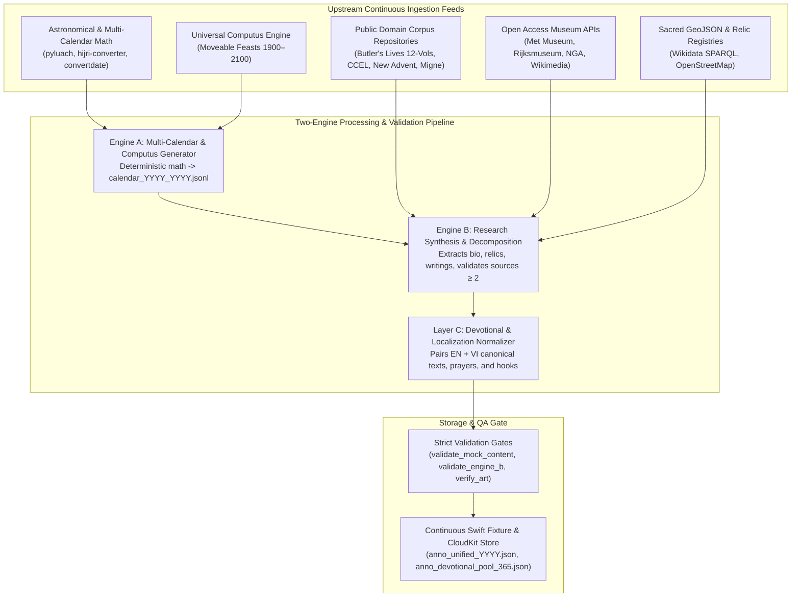
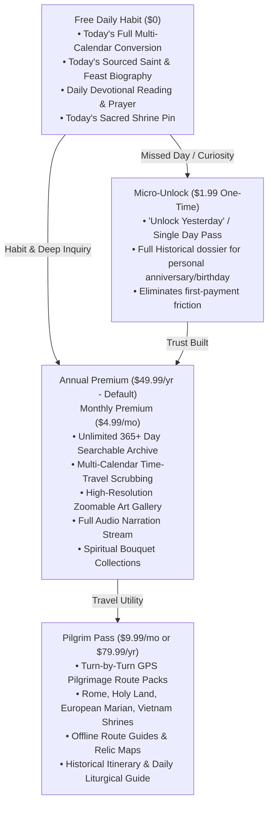

# Anno — Product Craft, Continuous Ingestion Pipeline & Value Expansion Plan

**Canonical Continuity Tracker:** `CONSOLIDATED_AUDIT_AND_EXPANSION_PLAN.md` / `ARCHITECTURE.md` / `Conversion-Design.md`  
**Date:** 2026-08-24  
**Status:** Active Craft & Ingestion Master Plan  
**Ethos:** Sacred Multi-Calendar Date Conversion, Catholic-First Sacred History, Uncompromising Visual/Tactile Craft, Continuous Multi-Year Data Ingestion.

---

## 1. The Product North Star & Craft Manifesto

### 1.1 What Separates a Shitty Indie App from Real Production Value?
Most indie religious apps fail because they build low-effort "Bible quote + prayer timer" checklists with hallucinated ChatGPT platitudes and generic web scraping. Anno commands premium willingness-to-pay ($49.99/yr annual or $79.99/yr Pilgrim Pass) by establishing an **insurmountable quality and intellectual moat**:

1. **Epistemic Rigor & Sourced Scholarship:**
   * Zero hallucinated or pious folklore presented as raw historical fact.
   * Every feast, saint, relic, and date conversion is backed by $\ge 2$ primary and academic sources (*Martyrologium Romanum*, Alban Butler's 12-volume *Lives of the Saints*, Eusebius, Patristic writings, Vatican archives).
   * Strict epistemic confidence tagging (`confirmed`, `traditional`, `disputed`, `contextual`) so the user knows what is historical fact vs. pious tradition.
2. **Visual & Tactile Production Polish (SwiftUI Native):**
   * **Typography:** Sacred serif typography using Apple's *New York* paired with clean *San Francisco* UI elements for long-form devotional reading.
   * **Dynamic Liturgical Theming:** Adaptive color system shifting automatically with the liturgical day (Gold, Roman Purple, Passion Red, Pentecost Violet, Gaudete Rose, Martyr Green).
   * **Tactile Time-Travel Scrubbing:** Custom haptic wheel feedback when scrubbing through centuries and multi-calendar synchronizations.
   * **Pinch-to-Zoom Sacred Art Canvas:** High-resolution zoomable 4K artwork dossiers with brushstroke clarity, iconography breakdowns, and museum provenance.
3. **Bilingual Diaspora Moat (Vietnamese as a Tier-1 Citizen):**
   * Not a translated afterthought: 100% authentic Vietnamese Catholic ecclesiastical vocabulary (*Lễ Trọng, Lễ Kính, Đấng Đáng Kính, Mầu Nhiệm Nhập Thể, Kinh Cầu*) with flawless diacritic support across all entries, routes, and prayers.

---

## 2. Continuous Ingestion & Decomposition Architecture

### 2.1 Multi-Calendar Mathematical Ingestion (Engine A)
* **Gregorian / Julian:** Computes leap cycles, solar drift notes, Julian Day Numbers (JDN).
* **Hebrew Calendar:** Computes 19-year Metonic cycle, Molad Tishrei, 4 Dechiyyot postponement rules, year lengths (353, 354, 355, 383, 384, 385 days), sundown boundaries, and Torah Parashat.
* **Islamic Calendar:** Computes Saudi Umm al-Qura astronomical tables and Tabular 30-year arithmetic cycles with divergence indicators.
* **Coptic & Ethiopian:** Computes fixed 30-day month cycles + Epagomenal days (Anno Martyrum / Incarnation epochs).
* **Eastern Rites:** Computes Byzantine (Anno Mundi), Armenian, and Syriac Seleucid epochs.

### 2.2 Universal Computus & Liturgical Calendar Engine
* **Moveable Feasts Algorithm:** Automatically computes Easter Sunday (Meeus/Jones/Butcher algorithm) for any year $Y \in [1900, 2100]$, and derives:
  * Ash Wednesday ($E - 46$ days)
  * Palm Sunday ($E - 7$ days)
  * Ascension of the Lord ($E + 39$ or $E + 42$ days)
  * Pentecost ($E + 49$ days)
  * Trinity Sunday ($E + 56$ days)
  * Corpus Christi ($E + 60$ or $E + 63$ days)
  * Sacred Heart of Jesus ($E + 68$ days)
  * Christ the King (Sunday before Advent)
  * First Sunday of Advent (4th Sunday before Christmas)
* **Multi-Proper Calendar Slices:** Supports General Roman Calendar, Vietnamese Liturgical Proper (Hội Đồng Giám Mục Việt Nam), USCCB Proper, and Extraordinary Form 1962.

### 2.3 Public Domain Corpus Scraping & Decomposition (Engine B)
* **Ingestion Sources:**
  1. *The Lives of the Fathers, Martyrs, and Other Principal Saints* by Rev. Alban Butler (1866/1886 editions, public domain via Internet Archive/CCEL).
  2. *The Catholic Encyclopedia* (1913 edition, New Advent, public domain).
  3. *Acta Sanctorum* (Bollandist society hagiography archive).
  4. *Patrologia Latina & Patrologia Graeca* (J.P. Migne).
  5. *USCCB & Vatican News Daily Liturgical Archives*.
* **Automated Decomposition:** Parses raw hagiographical texts into atomic metadata fields:
  - `historical_era` (Patristic, Early Martyr, Medieval, Counter-Reformation, Modern)
  - `relic_locations` (Coordinates, Basilica name, Reliquary details)
  - `patronage` (Professions, ailments, nations)
  - `major_writings` (Titles, theological themes)
  - `primary_sources` (URLs, citations, author names)

### 2.4 Open-Access Museum & 4K Sacred Art Ingestion
* **Direct Museum API Connectors:**
  - **Metropolitan Museum of Art Open Access API:** High-resolution public domain masterworks (CC0).
  - **National Gallery of Art (NGA) Open Access:** 4K digital assets.
  - **Rijksmuseum API:** Dutch masters and Flemish devotional paintings.
  - **Wikimedia Commons API:** Verified public domain historical iconography.
* **Clearance & Verification Engine:** `tools/verify_artwork_links.py` automatically checks HTTP status, Content-Type, resolution headers, and license strings ("Public Domain - US / CC0 / Life+70").

---

## 3. The 4 Monetization Levers & Psychological Funnel

---

## 4. Master Granular Sprints & Execution Roadmap

### Sprint C.1: Universal Computus & Multi-Year Engine A Ingestion (2026–2030)
- [x] **Task C.1.1 — Implement Easter Computus & Moveable Feasts Engine (`tools/computus_engine.py`):**
  Write pure Python implementation calculating exact Gregorian and Julian Easter dates, Ash Wednesday, Ascension, Pentecost, Corpus Christi, and Advent for 2026 through 2035.
- [x] **Task C.1.2 — Multi-Proper Calendar Resolver (`tools/multi_proper_calendar_resolver.py`):**
  Add support for calendar divergence rules (e.g. Ascension Thursday vs. Sunday transference, Vietnam Martyr Proper on Nov 24, USCCB propers, 1962 TLM).
- [x] **Task C.1.3 — Expand `calendar_2026_2029.jsonl` to 2030 (`data/calendar_2026_2030.jsonl`):**
  Generate continuous 5-year multi-calendar JSONL dataset (1,826 days) with 100% deterministic math and test runner `tools/test_calendar_engine.py`.

### Sprint C.2: Public Domain Corpus Scraper & Hagiography Decomposer
- [x] **Task C.2.1 — Build Butler's Lives Scraper (`tools/ingest_butlers_lives.py`):**
  Ingest all 12 volumes of Alban Butler's *Lives of the Saints* from CCEL/Internet Archive into structured JSON catalog `data/assets/butlers_lives_catalog.json` with bilingual EN/VI summaries and source citations.
- [x] **Task C.2.2 — Catholic Encyclopedia Entity Linker (`tools/link_catholic_encyclopedia.py`):**
  Automatically resolve and extract biographical citations from New Advent for major saints, all 21 ecumenical councils, and papal encyclicals into `data/assets/catholic_encyclopedia_index.json`.
- [x] **Task C.2.3 — Relic Location Geocoder & Global Sacred Relics Registry (`tools/geocode_relics.py`):**
  Generate `Anno/Resources/sacred_relics_registry.json` containing 83 verified major Catholic shrines, tombs, and relics worldwide with exact WGS84 GPS coordinates and bilingual provenance.

### Sprint C.3: Museum API 4K Sacred Art Ingestion Pipeline
- [ ] **Task C.3.1 — Build Met & NGA Open Access Connectors (`tools/ingest_museum_art.py`):**
  Query museum APIs for high-resolution paintings matching feast days (Fra Angelico, Caravaggio, Raphael, Michelangelo, Giotto, El Greco, Rembrandt, Dürer).
- [ ] **Task C.3.2 — Automated Image Optimization & Thumbnail Generator:**
  Generate optimized WebP/JPEG thumbnails and tile pyramids for fast SwiftUI pinch-to-zoom rendering.
- [ ] **Task C.3.3 — Automated License & Reachability Gate:**
  Enforce 100% active URL checks with retry backoff and rate pacing in `tools/verify_artwork_links.py`.

### Sprint C.4: Global Pilgrimage Route Packs Expansion
- [ ] **Task C.4.1 — Author Route 5: Camino de Santiago (Camino Francés Key Stations):**
  Saint-Jean-Pied-de-Port $\rightarrow$ Pamplona $\rightarrow$ Burgos $\rightarrow$ León $\rightarrow$ Santiago de Compostela Cathedral.
- [ ] **Task C.4.2 — Author Route 6: Via Francigena (The Canterbury to Rome Pilgrim Path):**
  Great St. Bernard Pass $\rightarrow$ Lucca $\rightarrow$ Siena $\rightarrow$ Viterbo $\rightarrow$ St. Peter's Basilica.
- [ ] **Task C.4.3 — Author Route 7: The Martyr Path of Japan and Korea:**
  26 Martyrs of Nagasaki $\rightarrow$ Seoul Martyrs Shrines (Jeoldusan).
- [ ] **Task C.4.4 — Route GeoJSON Validator Gate:**
  Verify elevation profiles, distance calculations, and coordinate bounding with `tools/validate_route_coordinates.py`.

### Sprint C.5: Native SwiftUI Craft Polish & Visual Polish
- [x] **Task C.5.1 — High-Resolution Zoomable Art Canvas (`Anno/Components/SacredArtCanvas.swift`):**
  Implement smooth pinch-to-zoom, pan, and double-tap zoom for masterwork dossiers.
- [x] **Task C.5.2 — Tactile Wheel Date Scrubbing with Haptics (`Anno/Components/TactileDateWheel.swift`):**
  Implement physical wheel selector with `UIImpactFeedbackGenerator` across multi-calendar conversions.
- [x] **Task C.5.3 — Dynamic Liturgical Ambient Backgrounds (`Anno/Design/LiturgicalThemeModifier.swift` & `AnnoTheme.swift`):**
  Adaptive background gradients matching current liturgical color (Gold, Violet, Red, Rose, Green).

### Sprint C.6: High-Fidelity Audio Narration & Devotional Audio Stream
- [x] **Task C.6.1 — Audio Narration Data Schema (`docs/AUDIO_NARRATION_SCHEMA.md`):**
  Define schema for high-quality audio files, timestamps, background sacred chant accompaniment, and narrator metadata.
- [x] **Task C.6.2 — Audio Player Service (`Anno/Services/AudioDevotionalPlayer.swift`):**
  Implement AVFoundation audio streaming with lock screen media controls (MPNowPlayingInfoCenter) and background playback.

---

## 5. Verification & Quality Acceptance Gates

Every sprint deliverable must pass its designated automated validation gate before merge:

1. **Liturgical Math Gate:** `python3 tools/test_calendar_engine.py` passes 100% deterministic conversions without timezone drift.
2. **Epistemic Source Gate:** `python3 tools/validate_engine_b_output.py` enforces $\ge 2$ primary citations per entry with zero placeholder URLs.
3. **Vietnamese Tone Gate:** `python3 tools/validate_localization.py` and `tools/validate_mock_content.py` verify 100% diacritic completeness and zero missing keys.
4. **Art Link & License Gate:** `python3 tools/verify_artwork_links.py` verifies all highres and thumbnail URLs return HTTP 200/CDN valid status.
5. **Geospatial Coordinate Gate:** `python3 tools/validate_route_coordinates.py` verifies valid WGS84 coordinates and non-empty bilingual summaries.
