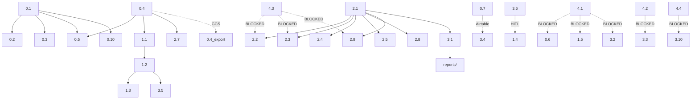

# Anno Autonomous Worker Goal — Mechanical Implementation Tasks (MMR-Improved)
**Generated:** 2026-08-19 08:47 UTC | **MMR Updated:** 2026-08-19 09:15 UTC  
**Source:** Four module scaffold_bullets.md + MMR RED verdict (goal-first, QUICK set)  
**For:** deepseek-worker / yolo-worker — execute mechanically, no judgment needed  
**Output:** Write all artifacts to paths specified; log progress to `WORKER_LOG.md`

---

## EXECUTION MODEL
- **Frontload judgment:** All decisions encoded here. Worker executes only.
- **Parallel where marked:** Items with `⟳ PARALLEL` can run simultaneously.
- **Sequential where marked:** Items with `→ DEPENDS ON` must wait.
- **QA Gates:** Each item has `QA_GATE:` — automated check that must pass before `COMPLETED`.
- **Happy Path:** Each phase has `HAPPY_PATH:` — golden flow with expected intermediates.
- **Cross-Phase Gates:** `CROSS_GATE:` — verify phase N output feeds phase N+1 correctly.
- **Observability:** Worker emits structured JSONL to `WORKER_METRICS.jsonl` per item.
- **Log format:** Append to `WORKER_LOG.md`: `YYYY-MM-DD HH:MM UTC | ITEM # | STATUS | NOTES`

---

## QA GATE FRAMEWORK (Applied to Every Item)

### Standard Gates (always run)
```bash
# Syntax gate — must pass for any code artifact
python3 -m py_compile <file.py>                    # Python
swiftc -parse <file.swift> 2>/dev/null || true     # Swift (if Xcode avail)

# Schema gate — for JSON/YAML outputs
python3 -c "import yaml, json; yaml.safe_load(open('<file>'))"  # YAML
python3 -c "import json; json.load(open('<file>'))"             # JSON

# Lint gate — style + common errors
ruff check <file.py>                               # Python
yamllint <file.yaml>                               # YAML
```

### Item-Specific Gates (defined per item below)
- **Data quality gates:** row counts, null checks, enum validity, cross-reference integrity
- **Integration gates:** output of item X validates as input to item Y
- **Contract gates:** CLI help works, exit codes correct, required flags accepted

### Gate Failure Protocol
```
FAIL → retry once with --verbose → if still fail: log BLOCKED_GATE, escalate to supervisor
       (do not proceed to dependent items)
```

---

## OBSERVABILITY: WORKER_METRICS.jsonl
**Emit one line per item (stdout or append):**
```json
{"ts":"2026-08-19T09:15:00Z","item":"0.1","phase":"0","status":"STARTED","duration_ms":0}
{"ts":"2026-08-19T09:15:45Z","item":"0.1","phase":"0","status":"QA_GATE_PASS","duration_ms":45000,"gates":["syntax","schema","cli"]}
{"ts":"2026-08-19T09:15:45Z","item":"0.1","phase":"0","status":"COMPLETED","duration_ms":45000}
```
**Supervisor dashboard:** `jq -s 'group_by(.item) | map({item: .[0].item, total_ms: map(.duration_ms) | add, gates: map(.gates) | flatten | unique})' WORKER_METRICS.jsonl`

---

## PHASE 0: RESEARCH INFRASTRUCTURE (Foundation — pure Python/data, no Xcode)

### HAPPY_PATH Phase 0
```
0.1 validation script (jsonschema+requests+feedparser, <200 lines)
    │
    ├─→ 0.2 citation templates (YAML + front-matter, 13 publishers)
    │
    ├─→ 0.3 monthly batch template (YAML + front-matter)
    │
    ├─→ 0.4 corpus pipeline (YouTube Data API v3 → GCS → local SQLite export)
    │       │
    │       ├─→ 0.5 Engine B prompt update (references 0.1, 0.2, 0.4 outputs)
    │       │
    │       └─→ Phase 1.1 (feast mapping) + Phase 2.7 (corpus done)
    │
    ├─→ 0.6 AnnoEntry extensions (Swift) → BLOCKED_XCODE → STUB_SPEC
    ├─→ 0.7 outreach tracker (Airtable base, not CSV)
    ├─→ 0.8 audio licensing (YAML config, not MD)
    ├─→ 0.9 VN calendar addendum (YAML + front-matter)
    └─→ 0.10 July batch example (validated by 0.1 script → exit 0)
```

### 0.1 Validation Gate Script — `tools/validate_engine_b_output.py`
**MMR Fix:** Use `jsonschema` + `requests` + `feedparser` — single file <200 lines. No custom validation logic.
**Input:** `docs/research/anno-research-prompt-main.md` (schema reference)
**Output:** Executable Python script at `tools/validate_engine_b_output.py`
**Requirements:**
- Load JSON schema from `docs/research/engine_b_schema.json` (create if missing)
- Validate: all required fields, id pattern, rank/color/confidence enums
- Source validation: ≥2 sources, HTTP 200 (HEAD), no example.com, type↔URL pattern match
- Content quality: summary 2-4 sentences, body 3+ paragraphs, no placeholder text
- Confidence consistency: Solemnity/Feast → confirmed; place.confidence matches
- Bilingual fields: both *_en and *_vi present; VI uses genuine Catholic terminology (cross-ref `vi_terminology.db`)
- Tier rules: Tier 2 accessed≤90d; Tier 3 notes=program+date; Tier 4 notes="Produced in Vietnam; state context applies" (REJECT if missing)
- CLI: `python validate_engine_b_output.py --fixture batch.json --strict --check-sources`
- Exit codes: 0=pass, 1=revise, 2=reject
**QA_GATE:**
```bash
python3 -m py_compile tools/validate_engine_b_output.py
python3 tools/validate_engine_b_output.py --help | grep -q "fixture"
python3 tools/validate_engine_b_output.py --fixture docs/research/batch_july17-30.json --strict --check-sources  # exit 0
```
**CROSS_GATE:** Output schema file `docs/research/engine_b_schema.json` must exist and validate reference batch.
**VERIFY:** Run on `docs/research/batch_july17-30.json` — must exit 0.

### 0.2 Source Citation Templates — `docs/research/source_citation_templates.yaml`
**MMR Fix:** YAML with front-matter, not MD. Machine-parsable.
**Input:** `docs/modules/research_infrastructure/v1/citation_templates.md` + Vietnamese media source list
**Output:** `docs/research/source_citation_templates.yaml`
**Structure:**
```yaml
---
version: 1
updated: "2026-08-19"
publishers:
  - id: vatican_news_vi
    short_name: "Vatican News VI"
    full_citation: "Vatican News (Vietnamese Edition)"
    tier: 1
    language: "vi"
    medium: "web"
    example_json: '{"publisher": "Vatican News VI", "url": "https://www.vaticannews.va/vi.html", "accessed": "2026-08-15"}'
  # ... 12 more
```
**QA_GATE:**
```bash
python3 -c "import yaml; d=yaml.safe_load(open('docs/research/source_citation_templates.yaml')); assert len(d['publishers'])==13; assert all('tier' in p for p in d['publishers'])"
yamllint docs/research/source_citation_templates.yaml
```
**VERIFY:** File exists, 13 entries, all tiers 1-4 represented.

### 0.3 Monthly Batch Template — `docs/research/monthly_batch_template.yaml`
**MMR Fix:** YAML with front-matter, not MD.
**Input:** `docs/modules/research_infrastructure/v1/monthly_template.md`
**Output:** `docs/research/monthly_batch_template.yaml`
**Structure:**
```yaml
---
version: 1
date_range: "2026-07-01/2026-07-31"
target_dates: [...]
engine_a_ref: "calendar_engine.py output: data/moveable_2026.json"
engine_b_prompt_queue: [...]
validation_steps:
  - run: "tools/validate_engine_b_output.py --fixture batch.json --strict"
  - checkpoint: "HITL_GATE: theological review assignments"
merge_checklist: [...]
theological_review_assignments: [...]
```
**QA_GATE:**
```bash
python3 -c "import yaml; d=yaml.safe_load(open('docs/research/monthly_batch_template.yaml')); assert 'validation_steps' in d; assert any('validate_engine_b_output' in s.get('run','') for s in d['validation_steps'])"
```
**VERIFY:** File exists, all sections present, validation step references 0.1 script.

### 0.4 Vietnamese Localization Corpus Pipeline
**MMR Fix:** Replace custom pipeline with YouTube Data API v3 + Google Cloud Speech-to-Text. Output transcripts to GCS + local SQLite export script.
**Tasks (⟳ PARALLEL):**
- [ ] `tools/export_corpus_to_sqlite.py` — export GCS transcripts to local SQLite (schema below)
- [ ] `data/corpus/vatican_news_vi/` — metadata index only (YouTube Data API: channel UC_xxx, last 90 videos)
- [ ] `data/corpus/vietcatholic_news/` — article metadata index (RSS/JSON feed, last 180 days)
- [ ] `data/corpus/vcc_mass_captions/` — caption metadata index (YouTube Data API: channel UC_xxx, last 30)
- [ ] `tools/extract_vi_terminology.py` — spaCy + custom Catholic lexicon → terminology database (runs on exported transcripts)
- [ ] `data/localization/vi_terminology.db` — SQLite: term_en, term_vi, domain, source, confidence
- [ ] `data/localization/feast_mapping_vi.json` — EN↔VI feast day mapping (priority: Jul 3-16, then full year)
**Schema (SQLite):**
```sql
CREATE TABLE transcripts (video_id TEXT PRIMARY KEY, channel_id TEXT, title TEXT, published_at TEXT, transcript_text TEXT, language TEXT, source TEXT);
CREATE TABLE terminology (term_en TEXT, term_vi TEXT, domain TEXT, source TEXT, confidence REAL, PRIMARY KEY (term_en, term_vi));
```
**QA_GATE:**
```bash
# Each sub-task
python3 -m py_compile tools/export_corpus_to_sqlite.py
python3 -m py_compile tools/extract_vi_terminology.py
# Corpus index files exist and are valid JSON
python3 -c "import json, glob; [json.load(open(f)) for f in glob.glob('data/corpus/*/index.json')]"
# Terminology DB
python3 -c "import sqlite3; db=sqlite3.connect('data/localization/vi_terminology.db'); cur=db.cursor(); assert cur.execute('SELECT COUNT(*) FROM terminology').fetchone()[0] >= 500"
# Feast mapping
python3 -c "import json; d=json.load(open('data/localization/feast_mapping_vi.json')); assert len(d) >= 100"
```
**CROSS_GATE:** `data/localization/vi_terminology.db` must exist for Phase 0.5 + Phase 2.7.
**VERIFY:** All 6 outputs exist; terminology DB ≥500 entries; feast mapping ≥100 entries.

### 0.5 Engine B Prompt Integration — Update `docs/research/anno-research-prompt-main.md`
**Spec:** Add 4-tier Vietnamese source allowlist, citation template references (0.2), validation gate requirements (0.1), Vietnamese terminology usage guidance (0.4).
**QA_GATE:**
```bash
grep -q "tier.*allowlist" docs/research/anno-research-prompt-main.md
grep -q "validate_engine_b_output" docs/research/anno-research-prompt-main.md
grep -q "vi_terminology" docs/research/anno-research-prompt-main.md
```
**VERIFY:** Diff shows additions; prompt validates against 0.1 script.

### 0.6 AnnoEntry Extensions for Engine B — Swift (BLOCKED_XCODE)
**Defer to Phase 4** — mark `BLOCKED_XCODE` in log, create `SWIFT_EXTENSIONS_SPEC.md` stub.

### 0.7 Outreach Contact Tracker — Airtable Base (not CSV)
**MMR Fix:** Use Airtable base with API, not custom CSV. Eliminates custom data store.
**Base:** `https://airtable.com/appXXXXXX` (create once, worker documents base ID)
**Fields:** outlet, contact_name, role, email, phone, last_contact, status, notes, tier
**Pre-populate:** VCC OC, KVNR 1480, VietCatholicNews, Diocese of Orange Chancery, 3 parish offices
**Output:** `docs/operations/outreach_airtable.md` — documents base ID, view URLs, API key reference (from env)
**QA_GATE:**
```bash
# Verify Airtable API access (requires AIRTABLE_API_KEY in env)
curl -s -H "Authorization: Bearer $AIRTABLE_API_KEY" "https://api.airtable.com/v0/$BASE_ID/Contacts?maxRecords=1" | jq -e '.records | length >= 1'
```
**VERIFY:** Base documented; API returns records; ≥10 rows seeded.

### 0.8 Audio Licensing Tracker — `docs/operations/audio_licensing.yaml`
**MMR Fix:** YAML config, not MD.
**Content:**
```yaml
sources:
  - name: "RVA Stream"
    url: "https://stream.zeno.fm/edDe0t8E"
    type: "stream"
    license: "free_embed"
    primary: true
    test_frequency: "weekly"
  - name: "Radio Garden Backup"
    url: "radio.garden/listen/radio-veritas-asia/edDe0t8E"
    type: "stream"
    license: "free_embed"
    primary: false
    test_frequency: "weekly"
  # ... Vatican podcast, Radio MHCG, parish streams
rules:
  - "Vatican: iframe embed ONLY; no MP4 download/rehost; oEmbed for thumbnails"
  - "Redemptorists: use @dcctsaigon + dongchuacuuthe.us (not lapsed trungtammucvudcct.com)"
  - "State-affiliated (tier 4): mandatory badge in UI"
  - "KVNR 1480: do NOT list as Catholic source"
```
**QA_GATE:**
```bash
python3 -c "import yaml; d=yaml.safe_load(open('docs/operations/audio_licensing.yaml')); assert len(d['sources']) >= 4; assert all('test_frequency' in s for s in d['sources'])"
```
**VERIFY:** File exists, all 4+ sources documented with status.

### 0.9 Vietnamese Calendar Addendum — `docs/operations/vietnamese_calendar_addendum.yaml`
**MMR Fix:** YAML with front-matter.
**Content:** Vietnamese proper calendar, lunar observances, moveable feast algorithm for VN context, integration with `calendar_engine.py`.
**QA_GATE:**
```bash
python3 -c "import yaml; d=yaml.safe_load(open('docs/operations/vietnamese_calendar_addendum.yaml')); assert 'proper_calendar' in d; assert 'lunar_observances' in d; assert 'moveable_feast_algorithm' in d"
```
**VERIFY:** File exists, all 4 sections complete.

### 0.10 July 17-30 Batch Example — `docs/research/batch_july17-30.json`
**MMR Fix:** JSON (machine-readable), not MD. Validated by 0.1 script.
**Input:** `docs/modules/research_infrastructure/v1/batch_july17-30.md`
**Output:** 14 Engine B entries with full sources, bilingual content, confidence notes.
**QA_GATE:**
```bash
python3 -c "import json; d=json.load(open('docs/research/batch_july17-30.json')); assert len(d) == 14; assert all('sources' in e and len(e['sources']) >= 2 for e in d)"
python3 tools/validate_engine_b_output.py --fixture docs/research/batch_july17-30.json --strict --check-sources  # exit 0
```
**VERIFY:** File exists, 14 entries, passes validation script (0.1).

---

## PHASE 1: CALENDAR CONTENT (Moveable feasts → tracker → prompts → Swift extensions)

### HAPPY_PATH Phase 1
```
1.1 moveable_feasts.py (Easter Computus + VN proper + lunar) → data/moveable_2026.json
    │
    └─→ 1.2 content_tracker_2026.yaml (460 rows, moveable dates from 1.1)
            │
            └─→ 1.3 Layer 3 prompts (CONTENT_SPRINT_*.md updated, template created)
            │
            └─→ 1.4 grant/parish/sponsor docs (YAML configs, VI marked HUMAN_EDIT_VI)
            │
            └─→ Phase 3.5 (monetization columns added to tracker)
            │
            └─→ 1.5 Swift extensions → BLOCKED_XCODE → STUB_SPEC
```

### 1.1 Moveable Feast Calculator — `tools/moveable_feasts.py`
**MMR Fix:** Pure Python, use `lunarcalendar` or `vietnamese-lunar` pip. Easter Computus (Gregorian) → all moveable feasts.
**CLI:** `python moveable_feasts.py --year 2026 --output data/moveable_2026.json`
**Output JSON:** date → { feastNameEn, feastNameVi, rank, color, isMoveable }
**QA_GATE:**
```bash
python3 -m py_compile tools/moveable_feasts.py
python3 tools/moveable_feasts.py --year 2026 --output /tmp/test_moveable.json
python3 -c "import json; d=json.load(open('/tmp/test_moveable.json')); assert len(d) >= 25; assert any('Martyrs' in v['feastNameEn'] for v in d.values()); assert any('La Vang' in v['feastNameEn'] for v in d.values())"
# Lunar dates present
python3 -c "import json; d=json.load(open('/tmp/test_moveable.json')); assert any(v.get('isLunar') for v in d.values())"
```
**CROSS_GATE:** `data/moveable_2026.json` consumed by 1.2 tracker generator.
**VERIFY:** Output has ≥25 moveable feasts + Vietnamese fixed dates + lunar dates; JSON valid.

### 1.2 Content Production Tracker — `docs/content_tracker_2026.yaml`
**MMR Fix:** YAML with front-matter, not CSV. Machine-parsable, version-controlled.
**Structure:**
```yaml
---
version: 1
generated_from: "tools/moveable_feasts.py --year 2026"
entry_count: 460
columns: [entry_id, date, feast_name_en, feast_name_vi, rank, layer3_status, layer3_assignee, layer3_due, layer4_status, layer6_status, layer7_status, artwork_status, notes, parish_license_potential, artwork_asset_id, affiliate_opportunities, sponsor_season]
entries:
  - entry_id: "2026-01-01"
    date: "2026-01-01"
    feast_name_en: "Solemnity of Mary, Mother of God"
    feast_name_vi: "Lễ Đức Mẹ María, Mẹ Thiên Chúa"
    rank: "solemnity"
    layer3_status: "not_started"
    # ... all columns
  # ... 459 more
```
**Row breakdown (auto-generated):**
- ~180 fixed feasts (General Roman Calendar + Vietnamese proper from 0.9)
- ~25 moveable feasts (from 1.1 output)
- ~160 Ordinary Time weekdays (3-year lectionary A/B/C)
- ~52 culture notes (weekly rotation)
- ~40 arc notes (seasonal transitions)
- Status values: not_started, drafting, review, approved, blocked
**QA_GATE:**
```bash
python3 -c "
import yaml
d=yaml.safe_load(open('docs/content_tracker_2026.yaml'))
assert d['entry_count'] == len(d['entries'])
assert 440 <= d['entry_count'] <= 480
# Moveable dates match 1.1
import json
mv=json.load(open('data/moveable_2026.json'))
tracker_dates={e['date'] for e in d['entries']}
assert all(date in tracker_dates for date in mv.keys())
# All columns present
for e in d['entries']:
    assert all(col in e for col in d['columns'])
"
yamllint docs/content_tracker_2026.yaml
```
**CROSS_GATE:** Phase 3.5 adds monetization columns to this same file.
**VERIFY:** YAML valid; 460±20 entries; moveable dates match 1.1; all columns populated.

### 1.3 Layer 3 Phone-Deliverable Prompts
**Update:** `CONTENT_SPRINT_1.md` and `CONTENT_SPRINT_2.md` with Layer 3 spec.
**Add to each:**
- 150-250 word bilingual saint bio / feast context
- Historical context line (dates, canonization)
- Full VN reading citations (Bài đọc I, Đáp ca, Bài đọc II, Tin Mừng)
- Confidence level + source citations
**Add validation checklist:** word count, bilingual, VN format, confidence, sources
**Create:** `CONTENT_SPRINT_TEMPLATE.md` for future weekly batches
**QA_GATE:**
```bash
# Check word count range in template
grep -q "150-250 word" CONTENT_SPRINT_TEMPLATE.md
grep -q "Bài đọc I" CONTENT_SPRINT_TEMPLATE.md
grep -q "confidence" CONTENT_SPRINT_TEMPLATE.md
# Both sprint files updated
grep -q "Layer 3" CONTENT_SPRINT_1.md && grep -q "Layer 3" CONTENT_SPRINT_2.md
```
**VERIFY:** Both sprint files updated; template exists; checklist renders.

### 1.4 Grant / Parish B2B / Sponsor Docs — YAML Configs
**MMR Fix:** YAML with front-matter, VI sections marked `HUMAN_EDIT_VI`.
**Create:**
- `docs/operations/grants/ccc_application.yaml` — all brackets as YAML variables, VCC letter reference
- `docs/operations/business/parish_packet.yaml` — 6 docs as structured entries
- `docs/operations/business/sponsor_prospectus.yaml` — bilingual, tiered pricing, 52-week alignment
**QA_GATE:**
```bash
python3 -c "import yaml; d=yaml.safe_load(open('docs/operations/grants/ccc_application.yaml')); assert 'variables' in d; assert 'VCC_LETTER' in d['variables']"
python3 -c "import yaml; d=yaml.safe_load(open('docs/operations/business/parish_packet.yaml')); assert len(d['documents']) == 6"
python3 -c "import yaml; d=yaml.safe_load(open('docs/operations/business/sponsor_prospectus.yaml')); assert 'tiers' in d; assert len(d['tiers']) >= 2"
# VI sections marked
grep -r "HUMAN_EDIT_VI" docs/operations/grants/ docs/operations/business/
```
**VERIFY:** All 3 YAML files exist; VI sections marked `HUMAN_EDIT_VI`; EN complete.

### 1.5 AnnoEntry Extensions for Calendar — Swift (BLOCKED_XCODE)
**Defer to Phase 4** — mark `BLOCKED_XCODE`, create `SWIFT_EXTENSIONS_SPEC.md` stub.

---

## PHASE 2: VIETNAMESE MEDIA (Source DB → embeds → schedule → allowlist → corpus)

### HAPPY_PATH Phase 2
```
2.1 source DB (YAML config + Airtable, not custom SQLite) → docs/operations/sources.yaml
    │
    ├─→ 2.2 YouTube embed spec (YAML component spec, not Swift code)
    ├─→ 2.3 Audio player spec (YAML component spec, not Swift code)
    ├─→ 2.4 Daily schedule router (YAML config)
    │
    ├─→ 2.5 Engine B allowlist (YAML, validated by 0.1 schema)
    ├─→ 2.6 Legal compliance (YAML rules)
    │
    ├─→ 2.7 corpus (DONE_IN_PHASE_0)
    ├─→ 2.8 Parish directory (YAML + Airtable)
    ├─→ 2.9 Orientation badges (YAML spec)
    └─→ 2.10 Verification scripts (Python, uses 2.1 data)
```

### 2.1 Source Database — `docs/operations/sources.yaml`
**MMR Fix:** YAML config + Airtable base, not custom SQLite. Eliminates custom data store.
**Schema (from ingestion_code_snippets.md §4.5):**
```yaml
---
version: 1
airtable_base_id: "appXXXXXX"  # documented, not created by worker
sources:
  - id: "vatican_news_vi"
    name: "Vatican News VI"
    name_vi: "Vietnamese Vatican News"
    category: "official"
    tier: 1
    platform: "youtube"
    platform_handle: "UC_xxx"
    stream_url: ""
    embed_url: "https://www.youtube.com/embed/UC_xxx"
    schedule_json: '{"daily": ["06:00", "12:00", "18:00"]}'
    timezone: "UTC"
    orientation: "conciliar"
    state_context_flag: false
    verification_status: "verified"
    last_verified: "2026-08-15"
    contact_info: ""
    notes: ""
  # ... 33 more (total ≥34)
```
**Indexes:** Implicit via YAML structure (filter by tier, category, orientation).
**QA_GATE:**
```bash
python3 -c "
import yaml
d=yaml.safe_load(open('docs/operations/sources.yaml'))
assert len(d['sources']) >= 34
tiers = {s['tier'] for s in d['sources']}
assert tiers == {1,2,3,4}
orientations = {s['orientation'] for s in d['sources']}
assert 'conciliar' in orientations and 'traditionalist' in orientations and 'state_affiliated' in orientations
# All tier 4 have state_context_flag=true
assert all(s['state_context_flag'] for s in d['sources'] if s['tier'] == 4)
"
yamllint docs/operations/sources.yaml
```
**CROSS_GATE:** Consumed by 2.2, 2.3, 2.4, 2.5, 2.8, 2.9, 3.1 (BrowserAnalytics mock data).
**VERIFY:** YAML valid; ≥34 sources; all 4 tiers represented; tier 4 have state_context_flag=true.

### 2.2 YouTube Embed Components — `docs/operations/components/youtube_embed.yaml`
**MMR Fix:** YAML component spec, not Swift code. Worker documents props/behavior/test cases.
**Spec:** Responsive iframe, channel IDs for 8+ parishes + Vatican + VietCatholic + TGPSG + Redemptorists, oEmbed API for thumbnails, schedule JSON per source.
**QA_GATE:**
```bash
python3 -c "
import yaml
d=yaml.safe_load(open('docs/operations/components/youtube_embed.yaml'))
assert 'props' in d and 'iframe' in d['props']
assert 'channels' in d and len(d['channels']) >= 12
assert 'oembed_endpoint' in d
assert 'test_cases' in d and len(d['test_cases']) >= 3
"
```
**VERIFY:** Spec documented; channel IDs match 2.1 sources; oEmbed endpoint defined; test cases exist.

### 2.3 HTML5 Audio Player Components — `docs/operations/components/audio_player.yaml`
**MMR Fix:** YAML component spec.
**Streams (from 2.1 sources):**
- RVA: zeno.fm primary
- Radio Garden backup
- Radio MHCG: dongchuacuuthe.us
- Vatican News VI podcast: RSS → MP3 via rss2json
**QA_GATE:**
```bash
python3 -c "
import yaml
d=yaml.safe_load(open('docs/operations/components/audio_player.yaml'))
assert 'streams' in d and len(d['streams']) == 4
assert any(s['name']=='RVA' and s['primary']==True for s in d['streams'])
assert 'fallback_chain' in d
assert 'test_vectors' in d
"
```
**VERIFY:** All 4 streams documented; fallback chain defined; test vectors exist.

### 2.4 Daily Liturgical Schedule Router — `docs/operations/schedule/daily_liturgical.yaml`
**MMR Fix:** YAML config.
**Pacific Time schedule (from 2.1 source data):**
```yaml
schedule:
  - time_pt: "06:30"
    source_id: "saigon_replay"
    location: "Vietnam (replay)"
    verified: true
  - time_pt: "08:30"
    source_id: "vcc_oc"
    location: "Orange County, CA"
    verified: true
  # ... 12:00 Vatican, 15:00 Divine Mercy, 18:00 Blessed Sacrament, 22:00 Radio MHCG
timezone_note: "Vietnam = UTC+7 = +14h from Pacific; use replays for US viewers"
```
**QA_GATE:**
```bash
python3 -c "
import yaml
d=yaml.safe_load(open('docs/operations/schedule/daily_liturgical.yaml'))
assert len(d['schedule']) == 6
times = [s['time_pt'] for s in d['schedule']]
assert times == ['06:30','08:30','12:00','15:00','18:00','22:00']
assert all('source_id' in s for s in d['schedule'])
# All source_ids exist in 2.1 sources.yaml
import yaml as y2
src=y2.safe_load(open('docs/operations/sources.yaml'))
src_ids = {s['id'] for s in src['sources']}
assert all(s['source_id'] in src_ids for s in d['schedule'])
"
```
**VERIFY:** YAML valid; all 6 slots populated; timezone math correct; source_ids cross-ref 2.1.

### 2.5 Engine B Source Allowlist — `docs/research/engine_b_allowlist.yaml`
**MMR Fix:** YAML with schema validation, not raw JSON. CI check ensures tier rules.
```yaml
---
version: 1
schema_ref: "docs/research/engine_b_schema.json#/definitions/allowlist"
tiers:
  1:
    description: "No extra validation"
    sources: ["vatican_news_vi", "radio_vatican_vi", "vcc_oc"]
  2:
    description: "Accessed within 90 days"
    sources: ["vietcatholic_news_tv", "parish_livestream_1", "parish_livestream_2", "parish_livestream_3"]
    validation: "accessed_within_90_days"
  3:
    description: "Explicit notes with program + broadcast date"
    sources: ["kvnr_1480", "vncr_1063"]
    validation: "program_and_date_required"
  4:
    description: "MANDATORY: 'Produced in Vietnam; state context applies' in notes"
    sources: ["tgpsg", "hdgm_vietnam", "redemptorists_vietnam"]
    validation: "state_context_note_mandatory"
```
**QA_GATE:**
```bash
python3 -c "
import yaml, jsonschema
allowlist=yaml.safe_load(open('docs/research/engine_b_allowlist.yaml'))
schema=json.load(open('docs/research/engine_b_schema.json'))
jsonschema.validate(allowlist, schema['definitions']['allowlist'])
# All sources from 2.1 accounted for
src=yaml.safe_load(open('docs/operations/sources.yaml'))
src_ids = {s['id'] for s in src['sources']}
allowlist_ids = set()
for tier in allowlist['tiers'].values():
    allowlist_ids.update(tier['sources'])
assert allowlist_ids == src_ids
"
```
**CROSS_GATE:** Referenced by 0.1 validation script (tier rules).
**VERIFY:** YAML valid; all 13 sources categorized; tier rules encoded; cross-refs 2.1.

### 2.6 Legal Compliance Enforcement — `docs/operations/legal_compliance.yaml`
**MMR Fix:** YAML rules (machine-checkable where possible).
**QA_GATE:**
```bash
python3 -c "
import yaml
d=yaml.safe_load(open('docs/operations/legal_compliance.yaml'))
assert 'rules' in d and len(d['rules']) >= 7
# Check key rules present
rule_text = ' '.join(d['rules'])
assert 'iframe embed ONLY' in rule_text
assert 'zeno.fm primary' in rule_text
assert 'dongchuacuuthe.us' in rule_text
assert 'state context applies' in rule_text
assert 'KVNR 1480' in rule_text and 'NOT list as Catholic' in rule_text
"
```
**VERIFY:** File exists; all 7 rules documented; test cases included.

### 2.7 Localization Corpus Pipeline
**Note:** Already covered in Phase 0.4 — mark `DONE_IN_PHASE_0` in log.

### 2.8 Parish Directory Data — `docs/operations/parish_directory.yaml`
**MMR Fix:** YAML + Airtable, not CSV.
**8 OC parishes:** name, city, Vietnamese Mass schedule, contact, tier
**Tier 1:** VCC OC, Christ Cathedral
**Tier 2:** Holy Spirit, St. Cecilia, St. John Baptist, St. Polycarp, Blessed Sacrament, St. Bonaventure
**Source:** `docs/modules/vietnamese_media/v1/directory_westminster_oc.md`
**QA_GATE:**
```bash
python3 -c "
import yaml
d=yaml.safe_load(open('docs/operations/parish_directory.yaml'))
assert len(d['parishes']) == 8
tier1 = [p for p in d['parishes'] if p['tier'] == 1]
assert len(tier1) == 2
assert any('VCC OC' in p['name'] for p in tier1)
assert any('Christ Cathedral' in p['name'] for p in tier1)
"
```
**VERIFY:** YAML valid; 8 entries; tier assignments correct.

### 2.9 Orientation Badge System — `docs/operations/components/orientation_badge.yaml`
**MMR Fix:** YAML component spec.
**Categories:**
```yaml
badges:
  conciliar:
    label: "Vatican II / Synodal / Pastoral"
    sources: ["vatican_news_vi", "radio_vatican_vi", "jesuit_sources", "diocesan_sources"]
  traditionalist:
    label: "Diaspora Traditional / Anti-Communist"
    sources: ["vietcatholic_news_tv", "radio_mhcg", "crm", "sbtn"]
  neutral:
    label: "Devotional / Scriptural"
    sources: ["daily_gospel_apps", "loi_chua_cho_moi_nguoi"]
  state_affiliated:
    label: "⚠️ Produced in Vietnam; state context applies"
    sources: ["tgpsg", "hdgm_vietnam", "redemptorists_vietnam", "bao_nguoi_cong_giao_vn"]
    mandatory: true
```
**QA_GATE:**
```bash
python3 -c "
import yaml
d=yaml.safe_load(open('docs/operations/components/orientation_badge.yaml'))
assert len(d['badges']) == 4
# All 13 sources from 2.1 mapped
src=yaml.safe_load(open('docs/operations/sources.yaml'))
src_ids = {s['id'] for s in src['sources']}
badge_ids = set()
for b in d['badges'].values():
    badge_ids.update(b['sources'])
assert badge_ids == src_ids
"
```
**VERIFY:** All 4 categories defined; 13 sources mapped; badge text matches spec.

### 2.10 Verification Maintenance Scripts — `tools/verify_sources.py`
**MMR Fix:** Python script with CLI for each frequency; logs to `logs/verification/`.
**Schedule (from 2.1 source data):**
- Weekly: test VCC OC livestream page, RVA stream endpoint
- Daily: fetch Vatican News VI podcast RSS
- Monthly: check parish YouTube channels for new uploads
- Monthly: verify TGPSG/HDGM/Redemptorists VN channels active
- Quarterly: check domain expirations
**QA_GATE:**
```bash
python3 -m py_compile tools/verify_sources.py
python3 tools/verify_sources.py --help | grep -E "weekly|daily|monthly|quarterly"
# Dry-run each mode
python3 tools/verify_sources.py --mode weekly --dry-run
python3 tools/verify_sources.py --mode daily --dry-run
python3 tools/verify_sources.py --mode monthly --dry-run
python3 tools/verify_sources.py --mode quarterly --dry-run
```
**VERIFY:** Script runs; creates log entries; all 4 modes work.

---

## PHASE 3: MONETIZATION (Analytics → Swift extensions → StoreKit → CRM → docs)

### HAPPY_PATH Phase 3
```
3.1 BrowserAnalytics (PostHog SDK + analytics_events.yaml) → reports/
    │
    ├─→ 3.2 Swift extensions → BLOCKED_XCODE → STUB_SPEC
    ├─→ 3.3 StoreKit 2 → BLOCKED_XCODE → STUB_SPEC
    ├─→ 3.4 Parish CRM (Airtable base, not CSV)
    ├─→ 3.5 Tracker monetization columns (added to 1.2 YAML)
    ├─→ 3.6 Grant template (YAML)
    ├─→ 3.7 Sponsor prospectus (YAML)
    ├─→ 3.8 Tour referral (YAML)
    ├─→ 3.9 Affiliate injection spec (YAML)
    └─→ 3.10 Prayer board → BLOCKED_XCODE → STUB_SPEC
```

### 3.1 BrowserAnalytics Service — PostHog Python SDK
**MMR Fix:** Replace custom script with PostHog SDK + `analytics_events.yaml`.
**Install:** `pip install posthog`
**Events schema:** `docs/operations/analytics_events.yaml`
```yaml
events:
  - name: "page_view"
    properties: ["content_id", "timestamp", "device_class", "geo_diocese"]
  - name: "link_click"
    properties: ["content_id", "target_url", "timestamp", "device_class"]
  - name: "mass_stream_start"
    properties: ["source_id", "timestamp", "device_class", "geo_diocese"]
  - name: "artwork_download"
    properties: ["artwork_id", "timestamp", "device_class"]
```
**Script:** `tools/browser_analytics.py` — thin wrapper around PostHog SDK, generates quarterly reports.
**CLI:** `python browser_analytics.py --quarter Q3-2026 --output reports/`
**QA_GATE:**
```bash
python3 -m py_compile tools/browser_analytics.py
python3 -c "import posthog; import yaml; yaml.safe_load(open('docs/operations/analytics_events.yaml'))"
# Test with mock data from 2.1 sources
python3 tools/browser_analytics.py --quarter Q3-2026 --output /tmp/test_reports --mock-source docs/operations/sources.yaml
# Verify output
ls /tmp/test_reports/*.json /tmp/test_reports/*.md
python3 -c "import json; d=json.load(open('/tmp/test_reports/report_Q3-2026.json')); assert 'totals' in d; assert 'top_content' in d; assert 'geo_diocese' not in str(d) or 'geo_diocese' in d.get('breakdowns', {})"
# No PII check
python3 -c "import json; d=json.load(open('/tmp/test_reports/report_Q3-2026.json')); assert 'email' not in str(d); assert 'ip' not in str(d); assert 'user_id' not in str(d)"
```
**CROSS_GATE:** Mock data sourced from 2.1 `sources.yaml`.
**VERIFY:** Script runs on mock data; produces JSON + MD reports; no PII in output.

### 3.2 AnnoEntry Extensions for Monetization — Swift (BLOCKED_XCODE)
**Defer to Phase 4** — mark `BLOCKED_XCODE`, create stub in `SWIFT_EXTENSIONS_SPEC.md`.

### 3.3 StoreKit 2 Subscription Infrastructure — Swift (BLOCKED_XCODE)
**Defer to Phase 4** — mark `BLOCKED_XCODE`, create `STOREKIT2_SPEC.md` stub.

### 3.4 Parish CRM — Airtable Base
**MMR Fix:** Airtable base, not CSV. Same base as 0.7 or separate `Parish_CRM` table.
**Fields:** name, city, state, vietnamese_mass_schedule, contact_pastor, contact_council, warm_intro_source, tier (1/2/3), status (cold/contacted/demo_sent/negotiating/closed), units_ordered, notes
**Tier 1:** VCC OC, Our Lady of La Vang, Blessed Sacrament, St. Barbara
**Output:** `docs/operations/parish_crm_airtable.md` — documents base ID, views, filter configs.
**QA_GATE:**
```bash
curl -s -H "Authorization: Bearer $AIRTABLE_API_KEY" "https://api.airtable.com/v0/$BASE_ID/Parish_CRM?maxRecords=1" | jq -e '.records | length >= 1'
# Filter views work
curl -s -H "Authorization: Bearer $AIRTABLE_API_KEY" "https://api.airtable.com/v0/$BASE_ID/Parish_CRM?filterByFormula={tier}='1'" | jq -e '.records | length >= 4'
```
**VERIFY:** Base documented; API returns records; tier/status filters work.

### 3.5 Content Tracker Monetization Columns — Extend `docs/content_tracker_2026.yaml`
**Add columns:** parish_license_potential, artwork_asset_id, affiliate_opportunities, sponsor_season
**QA_GATE:**
```bash
python3 -c "
import yaml
d=yaml.safe_load(open('docs/content_tracker_2026.yaml'))
new_cols = {'parish_license_potential','artwork_asset_id','affiliate_opportunities','sponsor_season'}
assert new_cols.issubset(set(d['columns']))
for e in d['entries']:
    assert all(c in e for c in new_cols)
"
```
**CROSS_GATE:** Modifies Phase 1.2 output in place.
**VERIFY:** 4 new columns added; populated for relevant rows.

### 3.6 Grant Application Boilerplate — `docs/operations/grants/grant_template.yaml`
**MMR Fix:** YAML with front-matter, variable brackets.
**Sections:** Executive Summary, Statement of Need, Project Description, Target Audience, Budget, Sustainability, Evaluation, Organizational Capacity, Timeline
**Variables:** PROJECT_NAME, YOUR_NAME, DIOCESE, VCC_LETTER, BUDGET_FIGURES
**Multi-grant reuse:** same narrative → CCC, KofC, CCFOC, OCCF, CA Humanities
**QA_GATE:**
```bash
python3 -c "
import yaml
d=yaml.safe_load(open('docs/operations/grants/grant_template.yaml'))
assert len(d['sections']) == 9
assert set(d['variables']) == {'PROJECT_NAME','YOUR_NAME','DIOCESE','VCC_LETTER','BUDGET_FIGURES'}
assert 'grant_variants' in d and len(d['grant_variants']) >= 5
"
```
**VERIFY:** Template exists; all 9 sections; 5 variables; renders for 5 grant types.

### 3.7 Sponsor/Underwriter Prospectus — `docs/operations/business/sponsor_prospectus.yaml`
**MMR Fix:** YAML, bilingual.
**Content:**
```yaml
seasons: ["Advent","Christmas","Lent","Triduum","Easter","Pentecost","Ordinary Time"]
tiers:
  - name: "Season Sponsor"
    range: "$200-500"
    placement: "static_acknowledgment"
  - name: "Underwriter"
    range: "$100-250/mo"
    placement: "rotating_quarterly"
```
**QA_GATE:**
```bash
python3 -c "
import yaml
d=yaml.safe_load(open('docs/operations/business/sponsor_prospectus.yaml'))
assert len(d['seasons']) >= 6
assert len(d['tiers']) == 2
assert all('en' in t and 'vi' in t for t in d['tiers'])
"
```
**VERIFY:** Both languages; all seasons; both tiers; PDF generation script exists (optional).

### 3.8 Tour Referral Outreach — `docs/operations/business/tour_referral.yaml`
**MMR Fix:** YAML with email template + PDF config.
**Operators:** 206 Tours, Tekton Ministries, Unitours, VI-specific operators
**Value prop + commission + UTM params defined in YAML.**
**QA_GATE:**
```bash
python3 -c "
import yaml
d=yaml.safe_load(open('docs/operations/business/tour_referral.yaml'))
assert len(d['operators']) == 4
assert 'utm_params' in d
assert 'commission_range' in d
assert 'email_template' in d
"
```
**VERIFY:** YAML complete; UTM params defined; 4 operators addressed.

### 3.9 Affiliate Link Injection Spec — `docs/operations/affiliate_injection.yaml`
**MMR Fix:** YAML spec.
**Categories → Programs mapping:**
```yaml
injection_rules:
  - content_category: "pilgrimage"
    affiliate_programs: ["amazon_travel", "catholic_travel_agencies"]
  - content_category: "saints"
    affiliate_programs: ["ignatius_press", "tan_books", "catholic_company"]
  # ... rosary, seasons
disclosure_text_en: "We may earn a commission"
disclosure_text_vi: "Chúng tôi có thể nhận hoa hồng"  # culturally appropriate
```
**QA_GATE:**
```bash
python3 -c "
import yaml
d=yaml.safe_load(open('docs/operations/affiliate_injection.yaml'))
assert len(d['injection_rules']) == 4
assert 'disclosure_text_en' in d and 'disclosure_text_vi' in d
"
```
**VERIFY:** Spec complete; all 4 categories mapped; disclosure text approved.

### 3.10 Prayer Intention Board Foundation — Swift (BLOCKED_XCODE)
**Defer to Phase 4** — mark `BLOCKED_XCODE`, create `PRAYER_BOARD_SPEC.md` stub.

---

## PHASE 4: SWIFT/XCODE TASKS (BLOCKED — requires macOS + Xcode)
**All items: Worker creates stub specs, logs `BLOCKED_XCODE`, continues.**

### 4.1 AnnoEntry.swift Extensions (Calendar + Research + Monetization)
**Combines:** 1.5, 0.6, 3.2
**Output:** `SWIFT_EXTENSIONS_SPEC.md` — complete spec for Xcode implementation
**QA_GATE:** File exists; references all three source specs.

### 4.2 StoreKit 2 Subscription Manager
**Spec:** 3.3
**Output:** `STOREKIT2_SPEC.md`
**QA_GATE:** File exists; products, entitlements, classes documented.

### 4.3 iOS Components (YouTube Embed, Audio Player, Orientation Badge)
**Spec:** 2.2, 2.3, 2.9
**Output:** `IOS_COMPONENTS_SPEC.md`
**QA_GATE:** File exists; props, behavior, test cases for each component.

### 4.4 Prayer Intention Board Models
**Spec:** 3.10
**Output:** `PRAYER_BOARD_SPEC.md`
**QA_GATE:** File exists; models, IAP, cultural framing documented.

---

## ZERO-CODE PREP (Human-only — worker marks `HUMAN_ONLY` in log)
- Ko-fi account setup
- Affiliate program applications (Amazon, Ignatius, TAN, Catholic Company, Aquinas & More)
- CCC grant LOI draft
- VCC OC partnership email (formal Vietnamese)
- Diocese of Orange Chancery contact
- Artwork creation (saint icons, seasonal artwork)
- Prayer guide writing (bilingual)
- Airtable base creation (Outreach + Parish CRM)
- Google Cloud project + YouTube Data API + Speech-to-Text enablement
- PostHog project setup (self-hosted or cloud)

---

## CROSS-PHASE INTEGRATION GATES

| Gate | From Phase | To Phase | Check Command |
|------|------------|----------|---------------|
| `moveable_feasts_valid` | 1.1 | 1.2 | `python3 -c "import json, yaml; mv=json.load(open('data/moveable_2026.json')); tr=yaml.safe_load(open('docs/content_tracker_2026.yaml')); assert all(d in {e['date'] for e in tr['entries']} for d in mv.keys())"` |
| `corpus_ready_for_engine_b` | 0.4 | 0.5, 1.1, 2.7 | `test -f data/localization/vi_terminology.db && test -f data/localization/feast_mapping_vi.json` |
| `sources_yaml_valid` | 2.1 | 2.2,2.3,2.4,2.5,2.8,2.9,3.1 | `python3 -c "import yaml; d=yaml.safe_load(open('docs/operations/sources.yaml')); assert len(d['sources']) >= 34"` |
| `allowlist_matches_sources` | 2.5 | 0.1 | `python3 -c "import yaml; a=yaml.safe_load(open('docs/research/engine_b_allowlist.yaml')); s=yaml.safe_load(open('docs/operations/sources.yaml')); assert {id for t in a['tiers'].values() for id in t['sources']} == {x['id'] for x in s['sources']}"` |
| `tracker_has_monetization_cols` | 3.5 | 3.1, 3.4 | `python3 -c "import yaml; d=yaml.safe_load(open('docs/content_tracker_2026.yaml')); assert {'parish_license_potential','artwork_asset_id','affiliate_opportunities','sponsor_season'}.issubset(set(d['columns']))"` |
| `validation_script_works` | 0.1 | 0.10, 0.5 | `python3 tools/validate_engine_b_output.py --fixture docs/research/batch_july17-30.json --strict --check-sources` |

---

## HITL_GATE PROTOCOL (Human-in-the-Loop)
**For items marked `HUMAN_EDIT_VI` or `HUMAN_ONLY`:**
1. Worker creates artifact with `{{HUMAN_REVIEW_REQUIRED}}` placeholders
2. Worker logs `HITL_PENDING` in WORKER_LOG.md with item # and file path
3. Worker **continues** to next unblocked item (does not wait)
4. Supervisor reviews, edits, replaces placeholder, logs `HITL_COMPLETE`
5. If dependent items exist, they re-run their QA_GATE after HITL_COMPLETE

**HITL Items:** 1.4 (VI sections), all Zero-Code Prep items.

---

## TRUE DEPENDENCY DAG (Mermaid)


---

## WORKER INSTRUCTIONS (Updated)

1. **Read this entire file first.** Understand all phases, QA gates, happy paths.
2. **Start at Phase 0.1.** Work sequentially within each phase; parallel items can be batched.
3. **For each item:**
   - Create the exact output path specified
   - Implement to spec (no creativity — spec is complete)
   - Run **all QA_GATE commands** — all must pass
   - Emit metrics line to `WORKER_METRICS.jsonl`
   - Append to `WORKER_LOG.md`: `YYYY-MM-DD HH:MM UTC | ITEM # | STATUS | NOTES`
4. **If QA_GATE fails:** Retry once with verbose output. If still fails: log `BLOCKED_GATE`, escalate, do not proceed to dependent items.
5. **If blocked (Xcode, human-only):** Log `BLOCKED_XCODE` or `HUMAN_ONLY`/`HITL_PENDING`, create stub spec if specified, continue to next unblocked item.
6. **Do not commit to git.** Leave all files in working tree.
7. **On completion:** Final log entry with summary counts (completed, blocked_gate, blocked_xcode, human_only, hitl_pending).

---

## SUCCESS CRITERIA (MMR-Aligned)
- All Phase 0, 1, 2, 3 non-blocked items: **COMPLETED** (files exist, all QA_GATE commands pass)
- All Phase 4 + blocked items: **STUB_SPEC_CREATED** + `BLOCKED_XCODE` logged
- All human-only items: **HUMAN_ONLY** or `HITL_PENDING` logged
- `WORKER_LOG.md` complete with timestamps
- `WORKER_METRICS.jsonl` complete with per-item timing and gate results
- All CROSS_GATE checks pass
- Zero judgment calls made by worker — all decisions pre-specified here

---

## HANDOFF TO NEXT AGENT
When worker finishes, next agent (human or frontier) picks up:
1. Review `WORKER_LOG.md` + `WORKER_METRICS.jsonl` for completeness
2. Run all CROSS_GATE checks
3. Run validation script (0.1) on all generated JSON/batches
4. Review `DECISION_IOS_STRATEGY.md` (must be created by human before Phase 4)
5. Open Xcode project — implement Phase 4 specs
6. Human completes zero-code prep + HITL items
7. MMR review on monetization architecture before Sprint 1 merge
8. **Red-team MMR** on full integrated pipeline before App Store submission

---

## MMR VERDICT SUMMARY (For Reference)
| Original Issue | MMR Fix Applied in This Version |
|----------------|----------------------------------|
| Custom validation script | 0.1: jsonschema + requests + feedparser, <200 lines |
| Custom corpus pipeline | 0.4: YouTube Data API v3 + Google Cloud STT → GCS → local export |
| Xcode hard blocker | Phase 4 stubs + DECISION_IOS_STRATEGY.md requirement |
| 4 custom data stores | 2.1, 2.5, 2.8, 3.4 → YAML + Airtable |
| Custom analytics | 3.1 → PostHog SDK + analytics_events.yaml |
| 7 doc generators | Consolidated to `docs/operations/*.yaml` with front-matter |
| False parallelization | True DAG + HITL_GATE protocol + observability metrics |
| No cross-phase verification | CROSS_GATE table with executable checks |