# Anno — Visual Design Specification
**Last Updated:** 2026-07-08

This document serves as the canonical visual design specification for **Anno** (This Day in Catholic History). It translates the master visual design montage (`assets/93FD769C-A395-4F2A-ABAD-23F9185ED015.png`) into explicit layout, color, typography, component, and illustration specifications.

---

## 1. Core Visual Identity

Anno uses a **dark-mode-first, illuminated timeline** metaphor. The design draws inspiration from medieval manuscripts, chapel architecture, and historical cartography, utilizing rich gold accents against deep warm dark backdrops.

### Brand Metaphor: The Illuminated Folio
* Time is a sacred timeline: every date since the Incarnation holds a memory.
* The interface resembles a modern illuminated folio where text, iconography, and sacred art harmonize.
* **The art is the ornament**: UI decoration is minimized to let the historical artwork breathe.

### Color Palette

| Role | Name | Hex | Usage |
|---|---|---|---|
| **Background** | Narthex | `#13110E` | Primary canvas; warm near-black. |
| **Surface** | Choir | `#1F1B16` | Cards, elevated containers, sheets. |
| **Primary Accent** | Gold Leaf | `#C9A84C` | Hero icons, active states, feast markers. |
| **Gold Light** | Gilt | `#D9C06E` | Highlights, badges, selected states. |
| **Secondary** | Lapis | `#2B4A7C` | Marian feasts, links, selected map elements. |
| **Tertiary** | Crimson | `#8C2F3B` | Martyrs, alerts, liturgical red. |
| **Primary Text** | Vellum | `#EDE7DA` | Headlines and body text. |
| **Secondary Text** | Incense | `#9B9085` | Captions, metadata, dates. |
| **Dividers** | Ash | `#2E2A24` | Separators and card borders. |
| **Liturgical Green** | Verdigris | `#3B6B52` | Ordinary Time. |
| **Liturgical Violet** | Advent | `#5C3D6E` | Advent and Lent. |
| **Liturgical White** | Easter | `#F5F0E8` | Solemnities and light mode background. |

### Typography
* **Display / Headlines:** `New York Display` (System Serif, bookish, trusted).
* **Reading / Body:** `New York Text` (Serif, generous line height for readability).
* **UI Controls & Metadata:** `SF Pro` (Sans-serif, clean navigation and labels).
* **Pills / Badges:** `SF Pro Rounded` (Confidence pills, small controls).
* **Liturgical Latin:** `New York Italic` (Scholarly, italicized).
* **Numerical Dates:** `SF Pro Tabular` (Aligned calendar spacing).

---

## 2. Screen-by-Screen Visual Architecture

The application layout is structured around 8 core screens. Each screen is cropped and available for visual reference under `visuals/previews/`.

### 1. Onboarding
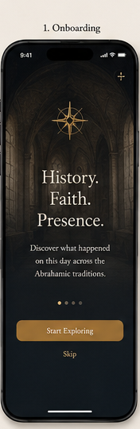
* **Goal:** Introduce the brand promise ("History. Faith. Presence. Discover what happened on this day across the Abrahamic traditions").
* **Key Elements:**
  * Centered illuminated compass icon.
  * Large serif title.
  * 4-step progress dots.
  * "Start Exploring" (Primary button) and "Skip" text link.

### 2. Today (Main Feed)
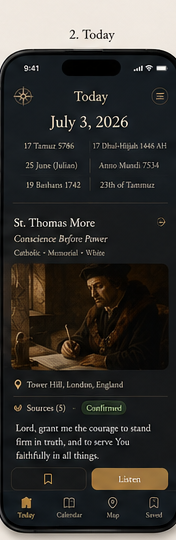
* **Goal:** Provide instant devotional value for the current day.
* **Key Elements:**
  * Title block: Date (e.g., "July 3, 2026") and historical conversions (Julian, Hebrew, Hijri, Coptic, Armenian).
  * Saint/Feast Header: E.g., "St. Thomas More" with liturgical type ("Memorial - White").
  * Hero Artwork Card: Beautifully framed sacred painting (e.g., Hans Holbein's portrait) with location subtitle ("Tower Hill, London, England").
  * Quick Actions: "Sources" count pill, "Confirmed" confidence badge, "Bookmark" (outline), and "Listen" audio button.
  * Devotional Content: Summary paragraph, historical prayer prompt, source verification details, and a multi-calendar conversion grid.

### 3. Calendar
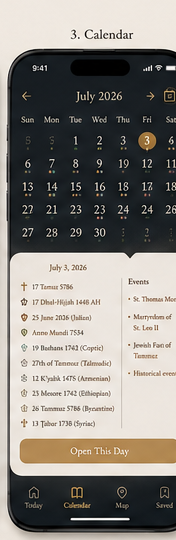
* **Goal:** Allow the user to navigate the density of history day-by-day.
* **Key Elements:**
  * Month grid view showing liturgical color indicators (dots) under dates.
  * Selected day event breakdown.
  * "Open This Day" action button.

### 4. Map
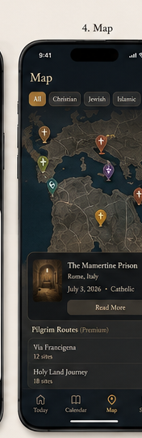
* **Goal:** Anchor devotion in physical geography and pilgrimage routes.
* **Key Elements:**
  * Custom styled dark map canvas with color-coded tradition pins (Gold, Purple, Green, Blue, Gray).
  * Selected location card (e.g., "The Mamertine Prison, Rome, Italy") with coordinates and description.
  * Pilgrim Routes selector ("Via Francigena", "Holy Land Journey").

### 5. Saved Collections
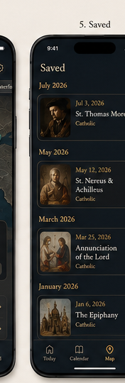
* **Goal:** Quick access to bookmarked dates and content.
* **Key Elements:**
  * Grouped chronologically (e.g., "July 2026", "May 2026").
  * Compact row layout with thumbnail art previews, date, name, and gold filled bookmark status.

### 6. Art Lightbox
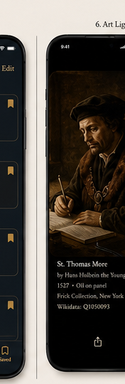
* **Goal:** High-fidelity inspection of sacred art assets.
* **Key Elements:**
  * Uncluttered portrait view of the artwork.
  * Slide-up description sheet showing Title, Artist (e.g., "Hans Holbein the Younger"), Year (1527), Medium ("Oil on panel"), Collection ("Frick Collection, New York"), and Wikidata ID.
  * "Report inaccuracy" text button.

### 7. Sources Sheet
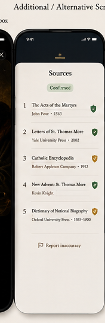
* **Goal:** Ensure scholarly credibility and source transparency.
* **Key Elements:**
  * "Sources Verified" green check header.
  * Chronological/ranked reference list (e.g., "The Acts of the Martyrs", "Letters of St. Thomas More", "Catholic Encyclopedia").
  * Direct links to sources.

### 8. Archive Paywall
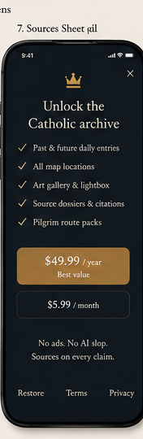
* **Goal:** Monetization while retaining trust and premium appeal.
* **Key Elements:**
  * Header: "Unlock the Catholic archive".
  * Value checklist: Past/future entries, all map locations, art gallery/lightbox, sources dossiers, pilgrim route packs.
  * Pricing selector: "$49.99/year (Best value)" vs "$5.99/month".
  * Trust footer: "No ads. No AI slop. Sources on every claim."
  * Terms & Privacy links.

---

## 3. UI Components & Atoms

### Buttons & Input Fields
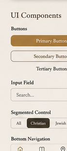
* **Primary Button:** Rounded rectangle, solid Gold Leaf background with dark text.
* **Secondary Button:** Rounded rectangle, Vellum outline with light text.
* **Tertiary Button:** Simple text link with chevron.
* **Search Input:** Capsule shaped, Ash border, thin magnifying glass icon.
* **Segmented Control:** Capsule container, solid active state background with high-contrast text.
* **Tab Bar:** Low profile bottom navigation using thin line icons.

### Icon Set (Line Icons)
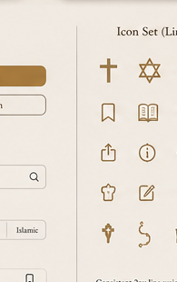
* **Style:** 2px line weight, rounded corners, sacred geometry flourishes.
* **Glyphs:** Cross, Star of David, Crescent, Church, Temple, Compass Rose, Bookmark (empty/filled), Open Book, Pin, Calendar, Volume, Share, Info, Sun, Moon, Notification, Edit, Trash, Shield, Check, Chalice, Rosary, Pilgrim Shell.

### Badges & Chips
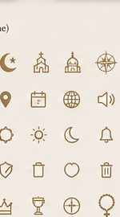
* **Confidence Badges:** Rounded pills with distinct borders/fills:
  * `Confirmed` (Green fill, white check)
  * `Traditional` (Gold outline, gold text)
  * `Disputed` (Crimson outline, crimson text)
* **Tradition Chips:** Color-coded labels indicating religious/historical context:
  * `Catholic` (Gold)
  * `Orthodox` (Purple)
  * `Jewish` (Green)
  * `Islamic` (Blue)
  * `Interfaith` (Gray)
* **Liturgical Colors:** Palette reference for Catholic calendar states (White, Red, Green, Purple, Rose, Black/Gray).

### Calendar Dots & Map Pins
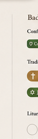 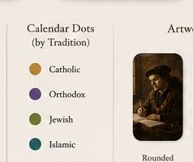
* **Calendar Dots:** Liturgical/Tradition dots placed under dates (Gold, Purple, Green, Blue, Gray).
* **Map Pins:** Custom teardrop shape with tradition icon overlays (Cross, Star of David, Crescent, Infinity).

### Artwork Frame Styles
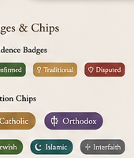
* **Rounded:** Clean, contemporary rounded corners.
* **Classic:** Thin Ash border around the artwork.
* **Ornate:** Detailed gold frame simulation for premium/solemnity events.

### Empty States
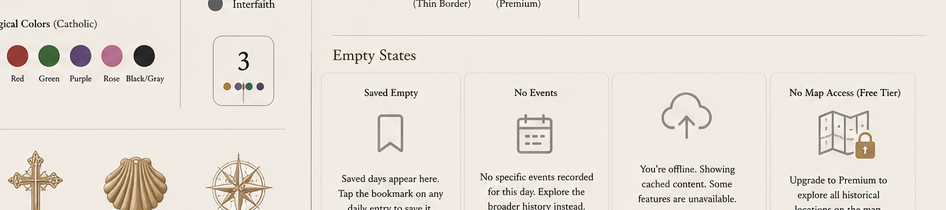
* Predefined layouts for "Saved Empty", "No Events", "Offline", and "No Map Access (Free Tier)".

---

## 4. Illustrations
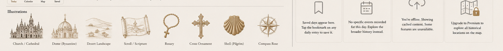
* Premium, hand-drawn vector style illustrations with a historical/manuscript vibe:
  1. **Church / Cathedral:** Classic gothic architecture.
  2. **Byzantine Dome:** Eastern liturgical style.
  3. **Desert Landscape:** Roots of early monasticism.
  4. **Scroll / Scripture:** Scholarly document representation.
  5. **Rosary:** Traditional devotional object.
  6. **Cross Ornament:** Celtic/Romanesque cross style.
  7. **Pilgrim Shell:** St. James scallop shell.
  8. **Compass Rose:** Maritime/pilgrimage navigation.

---

## 5. Design Discipline & Rules

1. **One Accent Per Screen:** Do not mix Lapis, Crimson, or Liturgical Green on the same view unless displaying specific contextual items. Gold Leaf is the default.
2. **Earned Ornamentation:** Use ornate frame styles or illuminated initial capitals only for solemnities or flagship historical events. Default to clean, modern layouts.
3. **No Pure Black/White:** Use Narthex (`#13110E`) for backgrounds and Vellum (`#EDE7DA`) for light text. Avoid `#000000` and `#FFFFFF`.
4. **Respect the Art:** Let historical artwork stand alone without visual noise around it. Never place text overlays directly on historical images.
